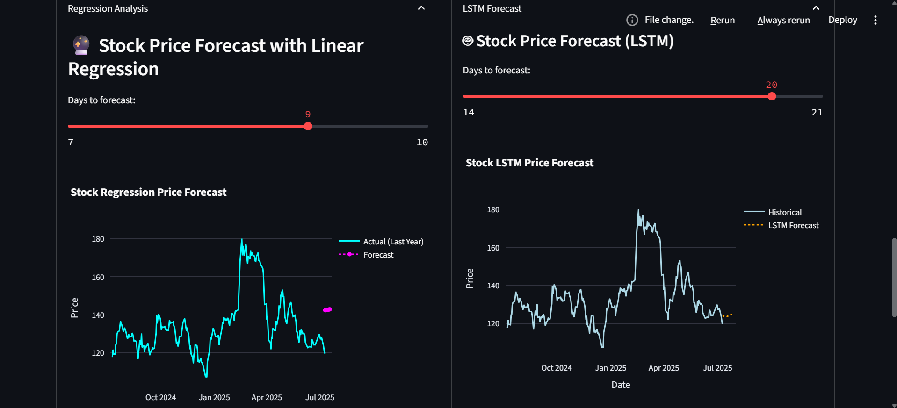
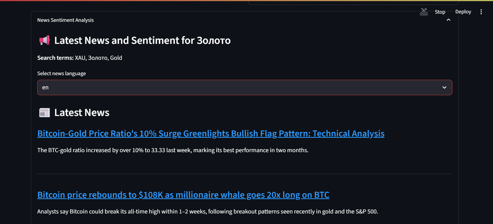
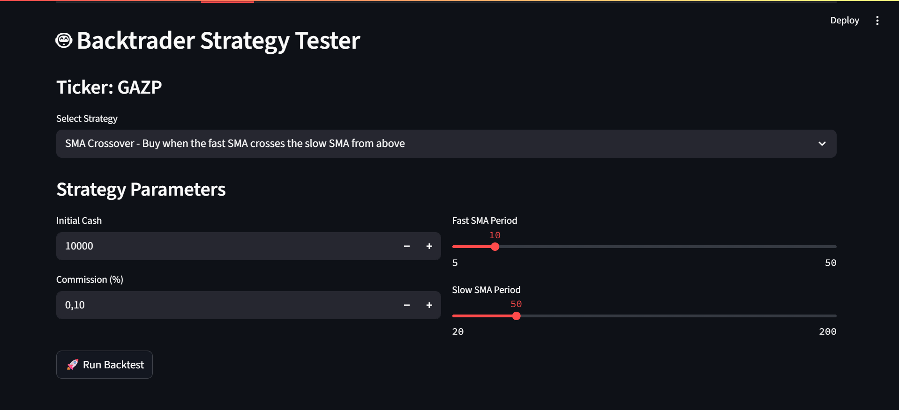
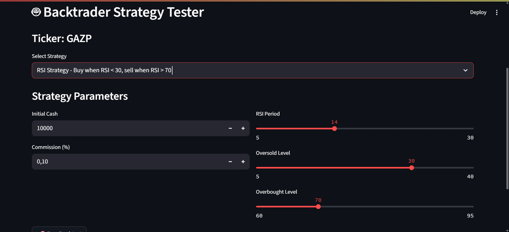
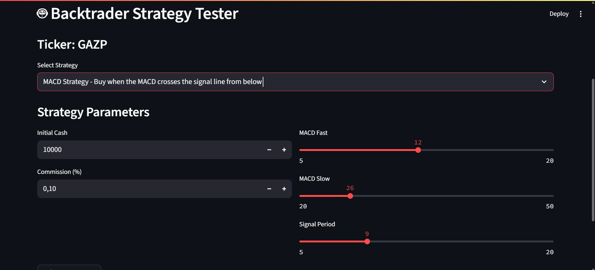

# Stock Market Analysis Dashboard

## 📌 Overview

An interactive Streamlit dashboard for advanced market analysis and forecasting using machine learning, technical indicators, and real-time news sentiment.

  
<sub>*Animated demo of the dashboard functionality*</sub>

---

### 🔍 Key Features

- 🧠 **Price Forecasting**
  - LSTM model (deep learning)
  - Linear Regression forecast
- 📉 **Technical Indicators**
  - Moving Averages (SMA)
  - RSI, MACD strategies
  - Volatility classification
- 📰 **News Sentiment Analysis**
  - Automated news collection & translation
  - Sentiment scoring via TextBlob & Transformers
- 💼 **Portfolio Tracker**
  - Tracks both stocks and precious metals
  - Calculates real-time valuation
- 🤖 **Backtesting Strategies**
  - SMA Crossover
  - RSI Strategy
  - MACD Strategy
- 📤 **Telegram Integration**
  - Send full reports (text + charts) directly to your Telegram
  - Get portfolio info from your Telegram & update forecast data

---

## 🛠️ Tech Stack

| Layer             | Libraries/Tools Used                                      |
|------------------|-----------------------------------------------------------|
| Frontend         | `Streamlit`                                               |
| Data Processing  | `Pandas`, `NumPy`                                         |
| Visualization    | `Plotly`, `Matplotlib`                                    |
| Machine Learning | `TensorFlow/Keras`, `scikit-learn`                        |
| NLP & News       | `BeautifulSoup`, `TextBlob`, `transformers`               |
| Backtesting      | `Backtrader`                                              |
| Messaging        | `requests`, Telegram Bot API (`python-telegram-bot`)      |

---

## 🖼️ Screenshots

### 📈 Forecast Charts
  
*LSTM and Linear Regression forecasts with confidence intervals*

### 📰 News Sentiment Analysis
  
*Real-time headlines and sentiment scoring using TextBlob and transformers*

### 🤖 Backtesting Reports
  
*SMA Crossover*
 
*RSI Strategy*
  
*MACD Strategy*

---

## 📡 Telegram Bot Setup (optional)

To enable Telegram reporting:

1. Create a bot via [@BotFather](https://t.me/botfather) on Telegram  
2. Copy your bot **API token** and your **chat ID**  
3. Add them to your config or `.env` file like this:

```env
BOT_TOKEN=your_bot_token
CHAT_ID=your_chat_id
NEWS_API_KEY = "your_news_api_key"
```

---

## 📊 Data Sources

- **Stock Prices**: [MOEX ISS](https://iss.moex.com/)
- **Metal Prices**: [Central Bank of Russia](https://www.cbr.ru/)
- **News**: [NewsAPI.org](https://newsapi.org/), Google News RSS

## 🚀 Installation

```bash
# Clone the repository
git clone https://gitlab.com/ladystuart/finance.git
cd finance

# Install dependencies
pip install -r requirements.txt

# Run the Streamlit app
streamlit run app.py
```

## 💻 Windows Launch Script

To simplify running the app and bot on Windows, a batch script (`run_finance.bat`) is included in the project root.

### What it does:
- Automatically creates and activates a Python virtual environment (`venv`) if it doesn't exist.
- Installs or updates required Python packages from `requirements.txt`.
- Launches the main application (`main.py`).

### How to use:
1. Make sure Python is installed and added to your system PATH.
2. Double-click the `run_finance.bat` file located in the project root folder to start the app.
3. (Optional) To create a desktop shortcut for easier access:
    - Right-click the `run_finance.bat` file and select **Create shortcut**.
    - Drag or copy the shortcut to your desktop.
    - You can rename the shortcut as you like.

This script handles environment setup and dependency installation automatically, making it easy to launch the application without manual setup steps.
